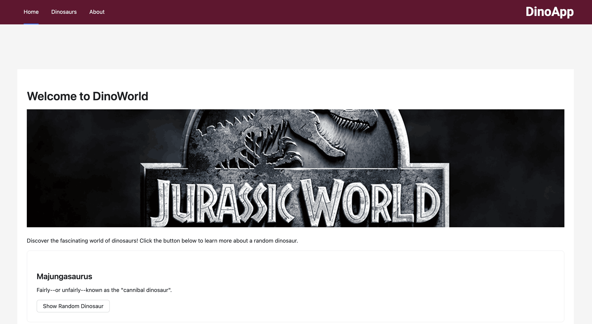
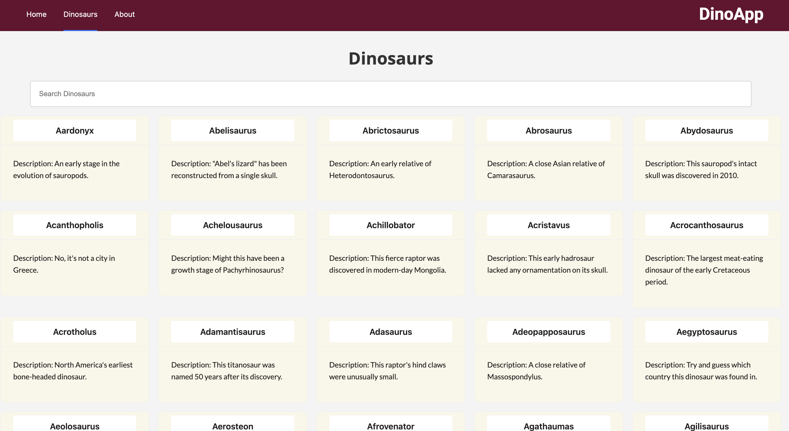

# React Dinosaurs

Welcome to the **React Dinosaurs** project! This application is built using modern web technologies like React, TypeScript, and Ant Design to provide an interactive and visually appealing experience for dinosaur enthusiasts.

This app uses the API https://dinosaur-facts-api.shultzlab.com/ to display dinosaur related info.

I wanted to experiment with this new library called Jotai for state management. I had a really good experience working with this library.

## Technologies Used


## Screenshots




## Features

- **React**: A powerful library for building dynamic user interfaces.
- **TypeScript**: Ensures type safety and better developer experience.
- **Ant Design**: A comprehensive UI framework for creating elegant and responsive designs.
- **Vite**: A fast build tool and development server for efficient development.
- **HMR**: Hot Module Replacement for a smooth development workflow.
- **ESLint**: Enforces code quality and consistency.

## About the App

This app is designed to showcase information about dinosaurs, including their history, characteristics, and fun facts. It leverages Ant Design components to create a polished and user-friendly interface.

Happy exploring the world of dinosaurs!

## Updates 

- May 2025 : Tried using AG grid to display tables, but it seems it has compatibility issues with React 19 So ended up using tables from Ant design instead.

## State Management using Jotai

Jotai is a lightweight state management library for React that uses atoms as the core building blocks for state. An atom represents a piece of state, and components that use an atom automatically re-render when the atom's state changes. Jotai provides a simple and flexible API, making it easy to manage both local and global state in your application without the need for complex boilerplate.

I have this file called atoms.ts inside the src folder. 

```
import { atom } from 'jotai';

export interface Dinosaur {
    Name: string;
    Description: string;
}

const dinosaursAtom = atom<Dinosaur[]>([]);
const randomDinosaur = atom<Dinosaur>()

export { dinosaursAtom, randomDinosaur };
```

I am using 2 atoms here one for random dinosaur and the other for a list of dinosaurs. Here is a sample usage of random dinosaur in the home screen.

```
import { useSetAtom, useAtom } from "jotai";
import { randomDinosaur } from "../atoms";

const setRandomDinosaur = useSetAtom(randomDinosaur);
  const [isLoading, setIsLoading] = React.useState(true);
  const dinosaur = useAtom(randomDinosaur);

  const getRandomDinosaur = async () => {
    try {
      setIsLoading(true);
      const response = await axios.get(
        "https://dinosaur-facts-api.shultzlab.com/dinosaurs/random"
      );
      setRandomDinosaur(response.data);
    } catch (error) {
      console.error("Error fetching random dinosaur:", error);
    } finally {
      setIsLoading(false);
    }
  };
```

You can render {dinosaur} inside your React template, this template would be re-rendered automatically if this atom changes.

## Support

If you like this project, please consider giving it a ⭐ on [GitHub](https://github.com/react_dinosaurs). Your support is greatly appreciated and motivates me to keep building awesome projects!


